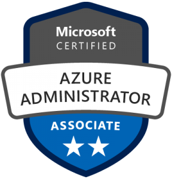

## About Me
My name is Bruno Corsino and I live in Lisbon, Portugal.
I am an Azure Administrator and I spend most of my days building solutions.

## My Cloud Journey
I started my journey in the cloud 4 years ago by doing a Cloud Identity Academy promoted by Microsoft Portugal. 

I joined **Microsoft Identity Team** a few months later as a Support Engineer.

Almost 2y passed, I decided to leave Microsoft to become an Azure Consultant. Since then I have worked and advised customers by using the best practices in the cloud.

## Certifications

[acclaim](https://www.youracclaim.com/users/brunocorsino)

## Disclaimer

The information in this weblog is provided “AS IS” with no warranties, and confers no rights.

This weblog does not represent the thoughts, intentions, plans or strategies of my employer. It is solely my opinion.

Feel free to challenge me, disagree with me, or tell me I’m completely nuts in the comments section of each blog entry, but I reserve the right to delete any comment for any reason whatsoever (abusive, profane, rude, or anonymous comments) – so keep it polite, please.
